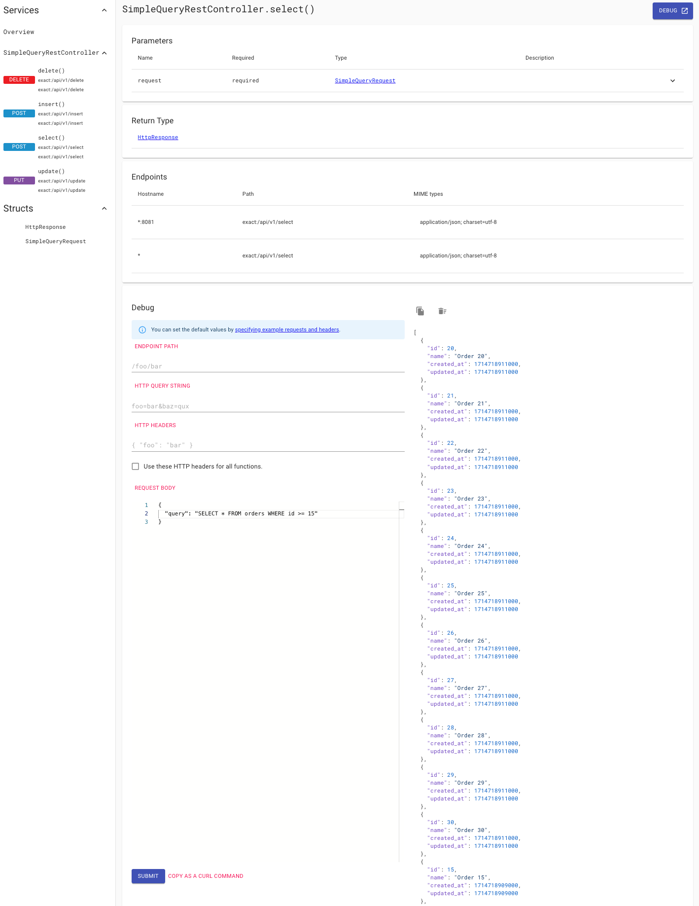
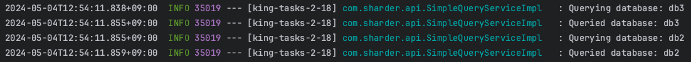

## How to run
Run the following command to start database
- MySql
  ```bash                      
  # Run the following command to start the database 
  $ docker-compose -f scripts/mysql/docker-compose.yml up -d
  
  # Run the following command to access the database 
  $ docker exec -it <container-name> mysql -uroot -pexample 
  
  # Run the following command to stop the database
  $ docker-compose -f scripts/mysql/docker-compose.yml down -v 
  ```
- PostgreSql - Currently not supported
  ```bash
  $ docker-compose -f scripts/postgresql/docker-compose.yml up -d
  ```

Run the following command to start the application. Replace the phase with the desired phase(use `local` as default)
```bash
$ ../gradlew :example:run -Pprofile=<phase> 
```
                       
Go to [docs](http://localhost:8080/docs) to access the API documentation


View which database has been queries 

